# IDS Fintech Products Portal

A full-stack internal web application for tracking Fintech products, clients, deployments,
team members, and related entities — built as part of a software development internship program covering database design, REST API development, authentication, and React/TypeScript frontend development.

## Project Purpose

IDS Fintech's products, client deployments, environments, and supporting teams were previously
tracked informally. This portal centralizes that information into a single internal tool where
employees can:

- Manage fintech products, their modules, repositories, and documentation
- Track clients and which products they use
- Manage deployments (which product version is live for which client, in which environment)
- Track team members and their responsibilities across products
- (Admin only) Manage user accounts and access

## Screenshots

###Login
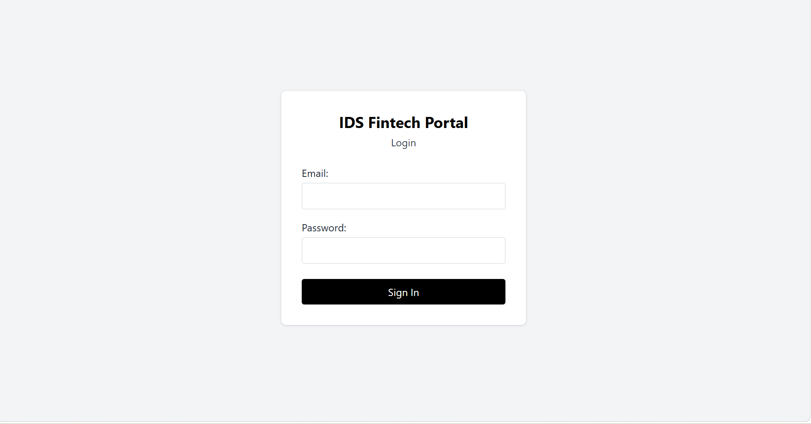

###Dashboard - Admin
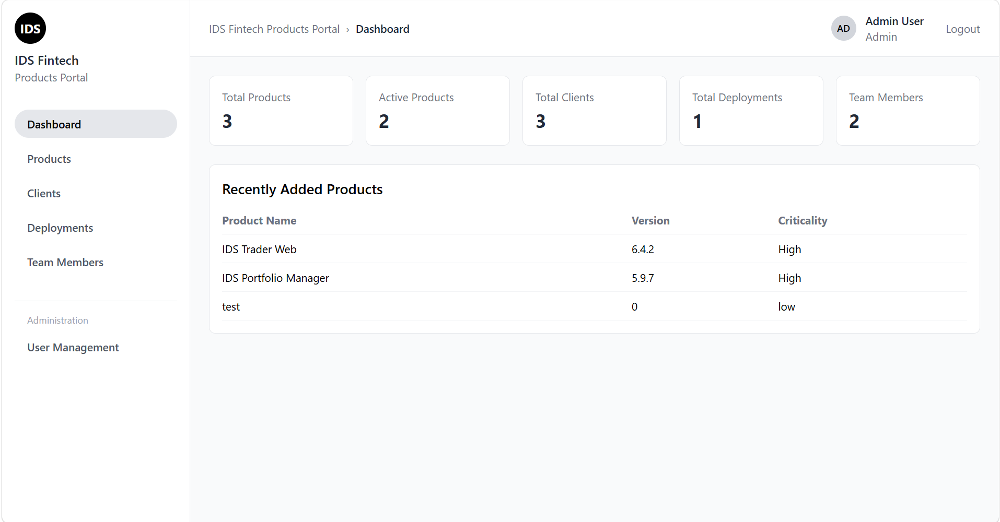

###Dashboard - Employee
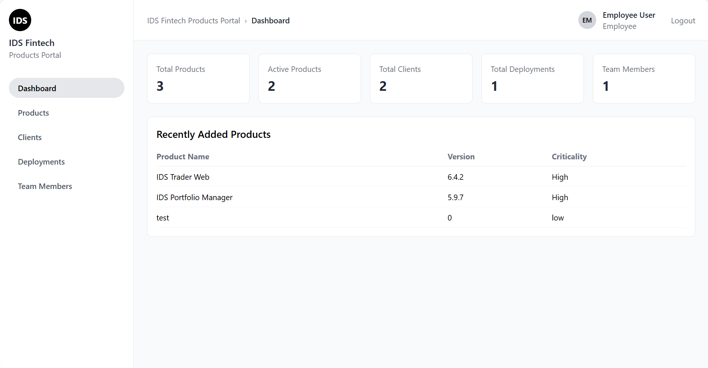

###Products List
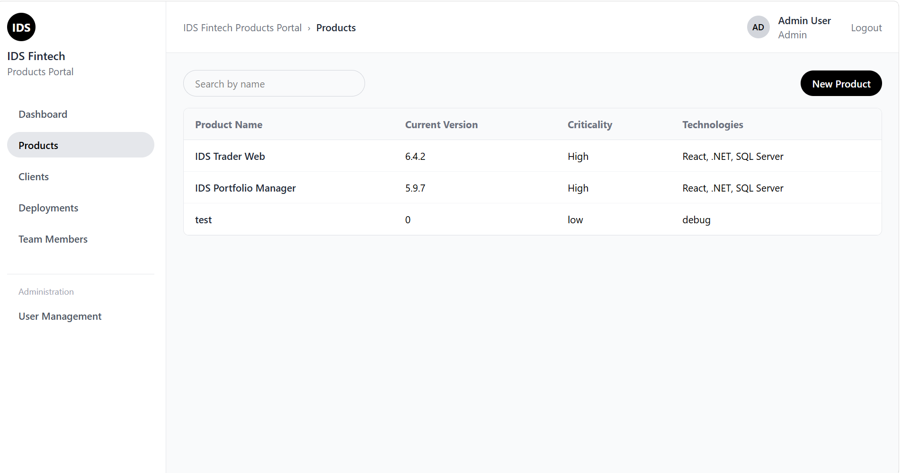

###Create Product
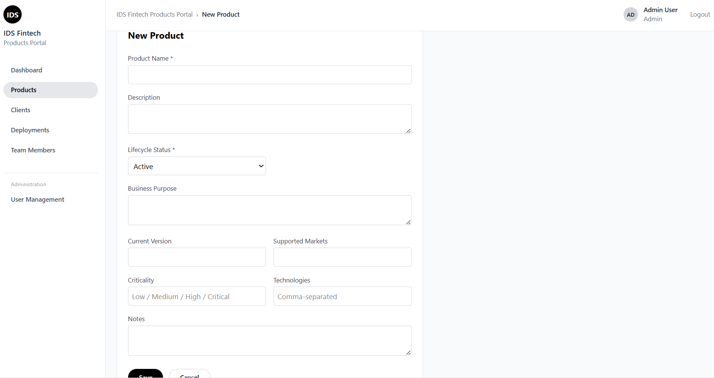

###Clients List
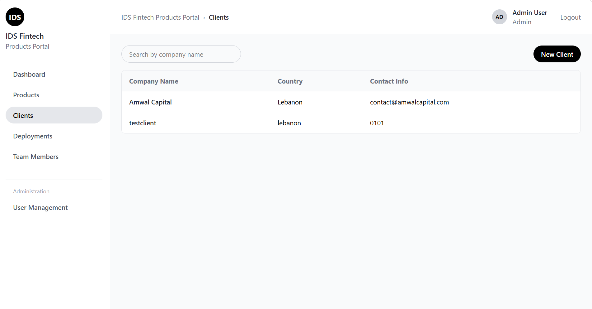

###Create Client
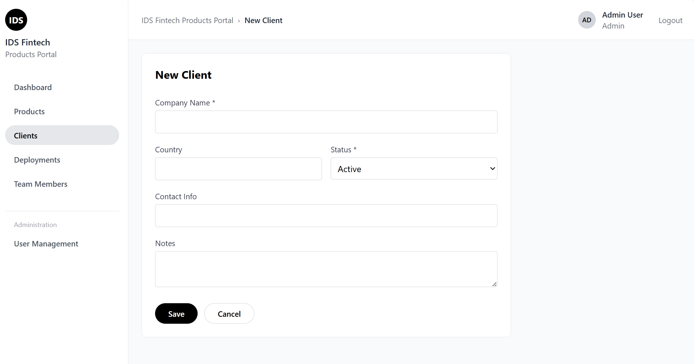

###Deployments List
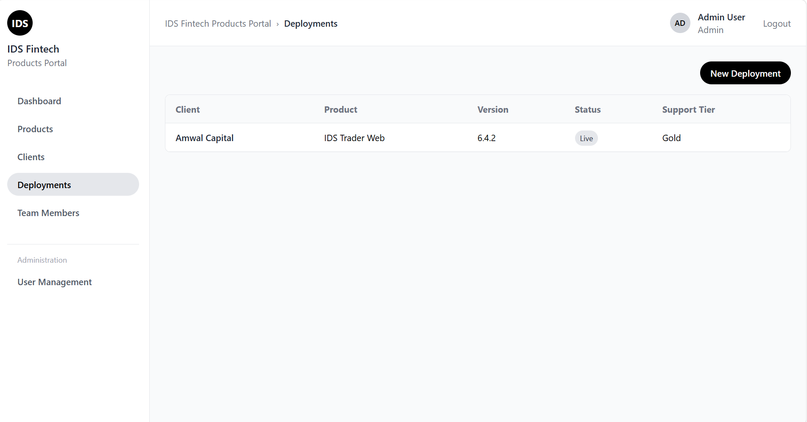

###Create Deployment
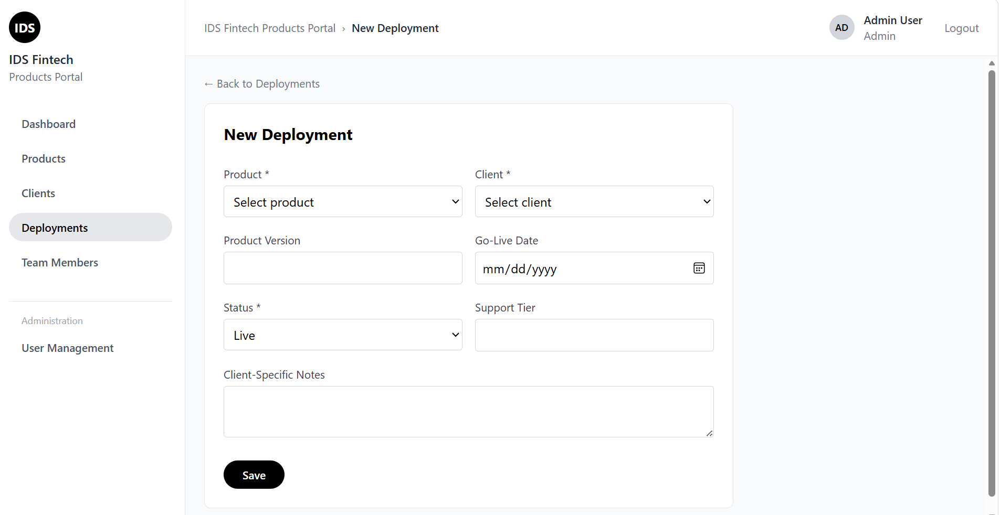

###Team Members List
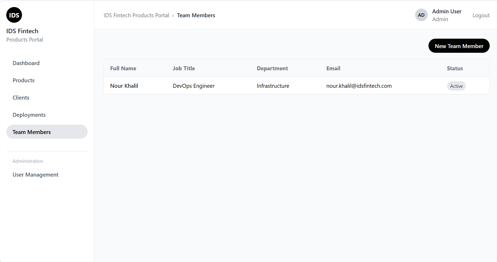

###Create Team Member
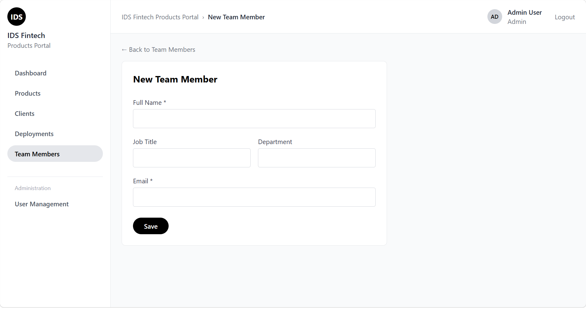

###User Management List
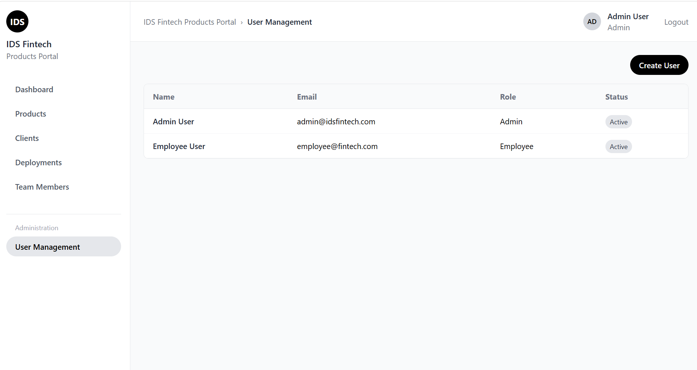

###Create User 
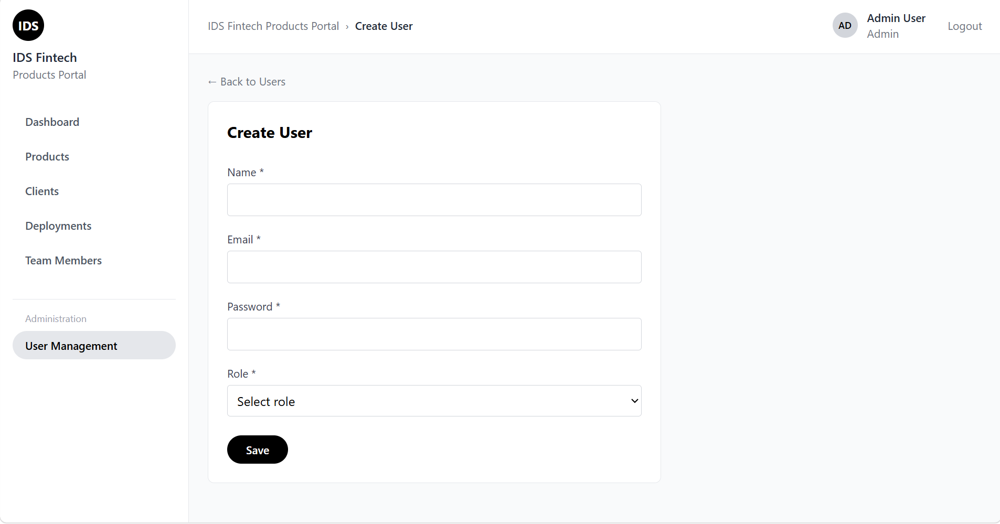

## Technology Stack

**Backend**
- .NET 8 Web API
- Dapper (micro-ORM, raw SQL over SQL Server)
- SQL Server
- JWT Bearer Authentication
- BCrypt.Net-Next (password hashing)
- Swagger / Swashbuckle (API documentation & testing)

**Frontend**
- React 19 + TypeScript
- Vite
- Tailwind CSS v4
- React Router DOM
- Axios

**Architecture**
>React Frontend → REST API (.NET) → SQL Server Database
The backend follows a layered architecture: **Controller → Service → Repository**, with interfaces at each layer for separation of concerns.

## Database

- 16 tables: lookup tables (Roles, ProductStatus, ClientStatus, ModuleStatus, DeploymentStatus), core entities (Users, Products, Clients, TeamMembers), dependent entities (Modules, Repositories, Documents, Deployments, Environments), and bridge/junction tables
(DeploymentModules, ProductResponsibilities).
- ERD and SQL creation/seed scripts are included in the `/database` folder.

### Entity-Relationship Diagram
See `/database/ERD.png`

### SQL Scripts
- `IDSFintechPortalDBscript.sql` — creates all tables, primary keys, foreign keys, and constraints
- `seedlookupdata.sql` — seeds required lookup values (Roles, all status tables)

## Prerequisites

- [.NET 8 SDK](https://dotnet.microsoft.com/download)
- [SQL Server](https://www.microsoft.com/sql-server) (Express or Developer edition) + SSMS
- [Node.js](https://nodejs.org/) (v18+) and npm

## Setup Instructions

### 1. Database Setup

1. Open SQL Server Management Studio (SSMS) and connect to your local instance.
2. Create a new empty database (e.g. `IDSFintechPortal`).
3. Open `database/IDSFintechPortalDBscript.sql` in a query window against that database and execute it.
4. Open `database/seedlookupdata.sql` and execute it to seed Roles and status values.

### 2. Backend Setup

```bash
cd IDSFintechPortal.Api
dotnet restore
```

Update `appsettings.json` with your SQL Server connection details:

```json
"ConnectionStrings": {
  "DefaultConnection": "Server=YOUR_SERVER_NAME;Database=IDSFintechPortal;Trusted_Connection=True;TrustServerCertificate=True;"
}
```

Run the API:

```bash
dotnet run
```

The API will start on `http://localhost:5295`.
Swagger UI is available at `http://localhost:5173/swagger`.

**Creating the first Admin user:** since user creation requires being logged in as an Admin already, the very first user must either be inserted directly via SQL (with a BCrypt-hashed password) or created through `POST /api/users` using Swagger before authentication is enforced
in your testing session.

### 3. Frontend Setup

```bash
cd ids-fintech-portal-frontend
npm install
```

Update `src/services/api.ts` with your backend's actual port:

```typescript
const api = axios.create({
  baseURL: 'http://localhost:5173/api',
});
```

Update the backend's CORS policy in `Program.cs` if your frontend runs on a different port than
`http://localhost:5173`.

Run the frontend:

```bash
npm run dev
```

Open the printed local URL (typically `http://localhost:5173`) in your browser.

## Environment Variables / Configuration

| Location | Key | Purpose |
|---|---|---|
| `IDSFintechPortal.Api/appsettings.json` | `ConnectionStrings:DefaultConnection` | SQL Server connection string |
| `IDSFintechPortal.Api/appsettings.json` | `Jwt:Key` | JWT signing secret (32+ characters) |
| `IDSFintechPortal.Api/appsettings.json` | `Jwt:Issuer` / `Jwt:Audience` | JWT token validation values |
| `IDSFintechPortal.Api/appsettings.json` | `Jwt:ExpiryMinutes` | Token lifetime |
| `ids-fintech-portal-frontend/src/services/api.ts` | `baseURL` | Backend API base URL |

No production secrets are stored in this repository; the JWT key present in `appsettings.json`
is a development-only placeholder value.

## Authentication & Roles

The system supports two roles:
- **Admin** — full access, including User Management (create/edit/deactivate users)
- **Employee** — full access to Products, Clients, Deployments, Team Members; no access to
  User Management

Authentication uses JWT Bearer tokens. On login (`POST /api/auth/login`), the API returns a signed token containing the user's identity and role, which the frontend stores and attaches to subsequent requests via an Axios interceptor.

## API Overview

All endpoints (except `/api/auth/login`) require a valid JWT Bearer token in the `Authorization` header. Full interactive documentation is available via Swagger UI once the backend is running.

| Entity | Base Route | Notes |
|---|---|---|
| Auth | `/api/auth/login` | Public |
| Users | `/api/users` | Admin only |
| Products | `/api/products` | Full CRUD |
| Modules | `/api/modules` | Full CRUD, linked to Products |
| Clients | `/api/clients` | Full CRUD |
| Deployments | `/api/deployments` | Full CRUD, links Products + Clients |
| DeploymentModules | `/api/deploymentmodules` | Many-to-many bridge (Deployment ↔ Module) |
| Environments | `/api/environments` | Full CRUD, linked to Deployments |
| TeamMembers | `/api/teammembers` | Full CRUD |
| ProductResponsibilities | `/api/productresponsibilities` | Bridge (Product ↔ TeamMember) |
| Repositories | `/api/repositories` | Full CRUD, linked to Products |
| Documents | `/api/documents` | Full CRUD, linked to Products |
| ProductStatus / ClientStatus / DeploymentStatus / Roles | read-only lookup endpoints | Used to populate dropdowns |

## Frontend Pages

- Login
- Dashboard (stat overview + recently added products)
- Products (List, Details with tabs for Modules/Clients/Team/Repositories/Documentation, Create/Edit)
- Clients (List, Details with tabs for Deployments/Environments/Responsible Team, Create/Edit)
- Deployments (List, Create/Edit with Enabled Modules management)
- Team Members (List, Create/Edit)
- User Management (Admin only — List, Create/Edit)

## Known Scope Decisions (MVP)

- Technologies are stored as a comma-separated string on Products rather than a separate many-to-many table (documented shortcut for MVP scope).
- Three status lookup endpoints (`ProductStatus`, `ClientStatus`, `DeploymentStatus`) use direct Dapper queries without a full layered architecture, since they are simple read-only reference data.
- Client "Responsible Team" is derived indirectly through the client's deployments and those products' team responsibilities, since responsibilities are tracked per-product rather than per-client in the schema.
- Document storage is limited to a URL/file reference per the requirement document — no file upload functionality is implemented.
- No Manager role tier — only Admin and Employee, per the requirement document.

## Repository Structure
```
IDS_Fintech_Products_Portal/
├── database/
│ ├── ERD.png
│ ├── IDSFintechPortalDBscript.sql
│ ├── seedlookupdata.sql
├── IDSFintechPortal.Api/ (backend)
└── ids-fintech-portal-frontend/ (frontend)
```

## Internship Objective

This project was built to practice the complete development lifecycle of a full-stack application: database design, entity relationships, REST API development, authentication and authorization, CRUD operations, backend validation, React/TypeScript development, API integration, search and filtering, Git-based version control, and debugging — with the goal of delivering a small, complete, and stable MVP rather than an exhaustive feature set.